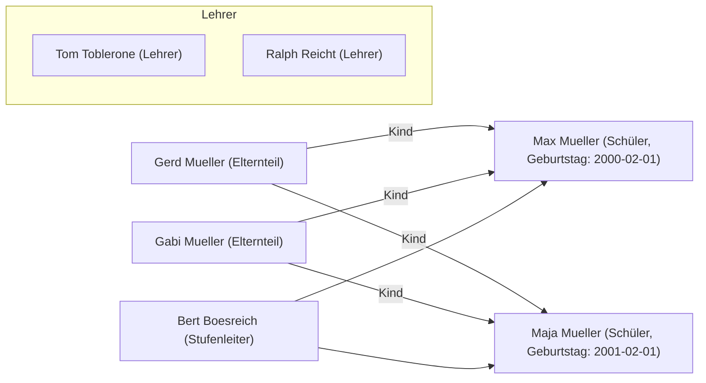

# Nutzer-Import aus einer CSV-Datei

Alle Nutzer per Hand zu erstellen wird schnell mühsam.
Um den Nutzer-Import einfacher zu gestalten, kann man Nutzer aus einer `.csv`-Datei importieren.

## Wie sieht diese CSV-Datei aus?

Jeder Nutzer hat verschiedene Eigenschaften, die gesetzt werden müssen:

- username (Benutzername)
- displayname (Anzeigename)
- password (Password des Nutzers)
- email (Email-Addresse)
- role (Rolle des Nutzers)
- birthday (Geburtstag)
- children (Liste der Kinder des Nutzers)
- graduationYear (vorraussichtliches Abitur-Jahr des Nutzers)

Falls `password` leer ist, erhält der/die Nutzer\*in bei der Erstellung eine Einladungs-Email, mit der er/sie das Passwort selber festlegen kann.

`children` muss nur für Eltern gesetzt werden.
Es enthält eine durch Doppelpunkt getrennte Liste der Benutzernamen der Kinder des/der Nutzer*in.
Hat ein*e Nutzer\*in keine Kinder, so wird es einfach freigelassen.

`birthday` muss nur für Schüler gesetzt werden.
Tragen sie hier das Geburtstag des Schülers im ISO-8601-Format ein (z.B. "2002-02-01" für den 01. Februar 2002).

`graduationYear` muss für Schüler und Stufenleiter gesetzt werden und enthält das vorraussichtliche Abitur-Jahr des/der Schüler\*in bzw. das Abitur-Jahr der Stufe, die der Stufenleiter betreut.

`role` enthält die Rolle des Nutzers: `admin` (Administrator), `parent` (Elternteil), `student` (Schüler), `manager` (Stufenleiter) oder `teacher` (Lehrer).

Die erste Zeile der Import-Datei muss die Spalten-Überschriften enthalten.

Eine Import-Datei könnte zum Beispiel so aussehen:

```csv
username,displayname,email,role,birthday,graduationYear,children
maxmueller,Max Mueller,mmueller@gmail.com,student,2000-02-01,2019,
majamueller,Maja Mueller,maja@mueller.de,student,2001-02-01,2019,
tomtoblerone,Tom Toblerone,toblerone@your-school.com,teacher,,,
gerdmueller,Gerd Mueller,gerd@mueller.de,parent,,,maxmueller:majamueller
gabimueller,Gabi Mueller,gabi@mueller.de,parent,,,maxmueller:majamueller
bertboesreich,Bert Boesreich,boesreich@your-school.com,manager,,2019,
ralphreicht,Ralph Reicht,reicht@your-school.com,teacher,,
```

Damit würden die folgenden Nutzer erstellt:



Um diese `.csv`-Datei zu erzeugen, können sie [diese Vorlage](https://gitlab.com/Skn0tt/EntE/raw/master/docs/assets/User%20Import%20Template.xlsx?inline=false) für Microsoft Excel verwenden.

## Wie importiere ich die CSV-Datei?

1. Gehen sie zu "Admin" und klicken sie auf den "Nutzer importieren"-Button.
2. Füllen sie das Formular aus.
3. Wählen sie "CSV" als Datenformat aus
4. ziehen sie die `.csv`-Datei in den Upload-Bereich. Alternativ können sie auf den Upload-Bereich klicken, um einen Datei-Manager zu öffnen.
5. Überprüfen sie die Nutzerangaben in der Nutzer-Tabelle.
6. Klicken sie auf den "Importieren"-Knopf, um den Import durchzuführen.
