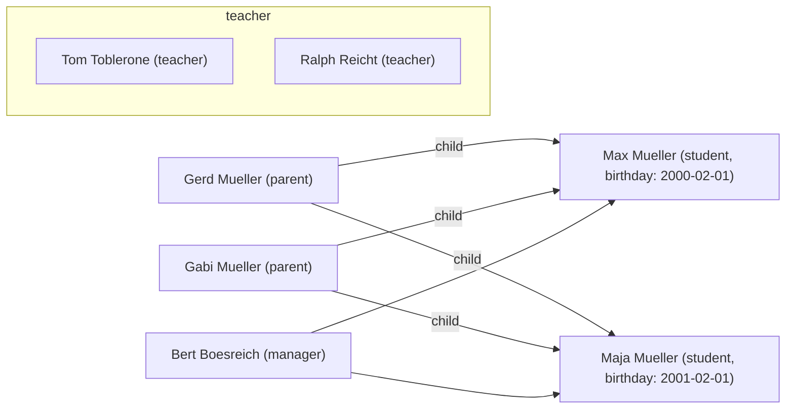

# User import from CSV files

Creating all users by hand can be cumbersome.
To make onboarding easier, you can import users from a `.csv` file.

## How to generate the CSV file

Each user has different properties that need to be set:

- username
- displayname
- password
- email
- role
- birthday
- children
- graduationYear

If `password` is left blank, a password reset will be invoked for the user so they can set their password themselves.

`children` should contain a list of the usernames of that users children, separated by colons.
If the user doesn't have any children, leave the field blank.

`birthday` needs to be set only for students; set it to their birthday in ISO-8601 format (e.g. "2000-02-01" for Feb. 1st, 2000).

`graduationYear` needs to be set for students and mangers, it matches these by their expected graduation year.

`role` is one of the roles `admin`, `parent`, `student`, `manager`, `teacher`.

The first row of the csv needs to be a header row with the above properties.

A sample import file could look like this:

```csv
username,displayname,email,role,birthday,graduationYear,children
maxmueller,Max Mueller,mmueller@gmail.com,student,2000-02-01,2019,
majamueller,Maja Mueller,maja@mueller.de,student,2001-02-01,2019,
tomtoblerone,Tom Toblerone,toblerone@your-school.com,teacher,,,
gerdmueller,Gerd Mueller,gerd@mueller.de,parent,,,maxmueller:majamueller
gabimueller,Gabi Mueller,gabi@mueller.de,parent,,,maxmueller:majamueller
bertboesreich,Bert Boesreich,boesreich@your-school.com,manager,,2019,
ralphreicht,Ralph Reicht,reicht@your-school.com,teacher,,
```

This would create the following users:



To create this `.csv` file, you can use the provided [template](https://gitlab.com/Skn0tt/EntE/raw/master/docs/assets/User%20Import%20Template.xlsx?inline=false) for Microsoft Excel.

## How to import the CSV file

Go to "Admin" and click on the "Import Users" button.
Fill out the options.
Select "CSV" as your import method.
Drag'n'drop your `.csv` file into the dropzone or click on it to open a file dialog.
Click on the "Submit"-Button to invoke the import.
